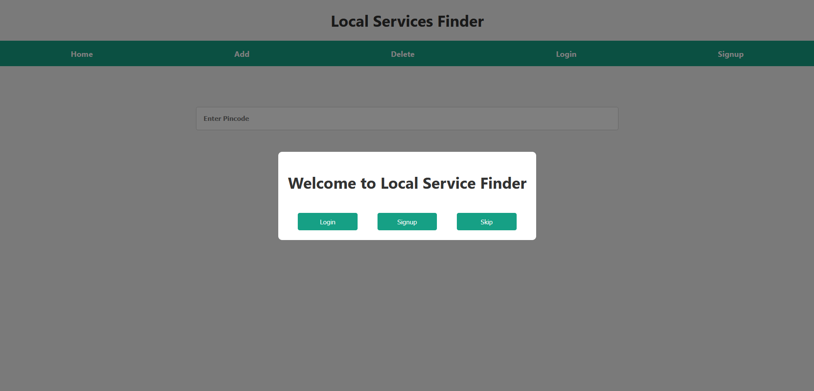

# Local Services Finder
 A concise and effective web application using the MERN stack (MongoDB, Express,
React, Node.js) to help users find and manage local services based on pin codes. The project
features CRUD operations and efficient pin code-based search functionality. The application uses
MongoDB for database management and React for a sleek, responsive frontend

# HomePage

# Sign-up Page

# Login Page

# Search Page

# Add Service Page

# Delete page

# React + Vite
This template provides a minimal setup to get React working in Vite with HMR and some ESLint rules.

Currently, two official plugins are available:

- [@vitejs/plugin-react](https://github.com/vitejs/vite-plugin-react/blob/main/packages/plugin-react/README.md) uses [Babel](https://babeljs.io/) for Fast Refresh
- [@vitejs/plugin-react-swc](https://github.com/vitejs/vite-plugin-react-swc) uses [SWC](https://swc.rs/) for Fast Refresh
